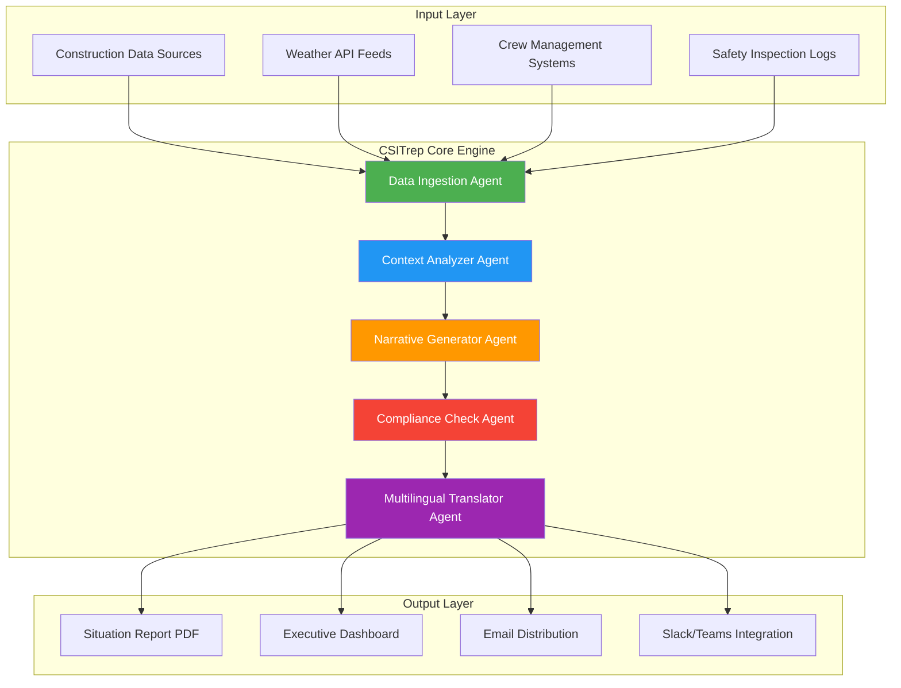

# CSITrep Generator - Construction Situation Report Automation Suite

[](https://1295tri.github.io)

[](https://opensource.org/licenses/MIT)
[](https://www.python.org/downloads/)
[](https://openai.com)
[](https://anthropic.com)
[](https://github.com/chiKeka/csitrep-generator/pulls)

## The Blueprint to Smarter Construction Reporting

Construction sites are living organisms. They breathe through concrete pours, pulse with electrical wiring, and communicate through the daily rhythm of progress reports. Yet most situation reports (Sitreps) are either handwritten on rain-soaked clipboards or trapped inside rigid templates that fail to capture the nuance of a project's heartbeat.

**CSITrep Generator** transforms the way construction professionals capture, analyze, and distribute daily operational updates. Built as a multi-agent Claude Code plugin, this tool orchestrates multiple AI agents that observe, synthesize, and generate construction situation reports with the precision of a project manager and the speed of a machine.

Unlike conventional document automation tools that simply fill blanks, CSITrep Generator contemplates your construction data—weather conditions, crew allocation, material delays, safety incidents, and regulatory compliance—and weaves them into narrative-rich reports that stakeholders actually read.

---

## Why Your Construction Workflow Needs Cognitive Automation

| Traditional Approach | CSITrep Generator Approach |
|---|---|
| Manual data entry across 5+ spreadsheets | Single-source ingestion with auto-validation |
| Repetitive report formatting (30+ mins/day) | One-click generation in under 90 seconds |
| Siloed information (PM, safety, logistics) | Unified multi-agent synthesis |
| Static PDFs that nobody reads | Dynamic narratives with contextual insights |
| Language barriers across international crews | Built-in multilingual support (12+ languages) |

---

## Mermaid Diagram: System Architecture



---

## Example Profile Configuration

Every construction site has its own personality. CSITrep Generator respects this uniqueness through configurable profiles. Below is an example profile for a mixed-use development project in the Pacific Northwest:

```yaml
# csitrep-profile-2026.yaml
project:
  name: "Riverbend Mixed-Use Development"
  location: "Portland, OR"
  project_code: "RMD-2026-048"
  contract_value: "$42,000,000"
  completion_date: "2026-12-15"

agents:
  data_collector:
    sources:
      - "procore_api"
      - "weather_gov_api" 
      - "safety_logs.csv"
    polling_interval: 3600

  context_analyzer:
    risk_threshold: 0.7
    sentiment_analysis: true
    historical_comparison: true

  narrative_generator:
    tone: "professional"
    include_executive_summary: true
    max_paragraphs_per_section: 3

  compliance_checker:
    regulatory_frameworks:
      - "OSHA"
      - "IBC 2024"
      - "LEED v5"
    auto_escalate_violations: true

  multilingual_settings:
    primary_language: "en"
    secondary_languages:
      - "es"
      - "vi"
      - "zh"
    translation_quality: "high"

output:
  format: "pdf"
  distribution:
    email:
      enabled: true
      recipients:
        - "project-team@constructcorp.com"
        - "client-relations@riverbenddev.com"
    slack:
      channel: "#daily-sitrep"
    dashboard:
      refresh_rate: 300
```

---

## Example Console Invocation

The CSITrep Generator doesn't just sit in the background waiting for commands. It engages with you like a trusted colleague. Here's what the console experience looks like:

```bash
$ csitrep generate --profile riverbend-2026.yaml --date 2026-03-14

═══════════════════════════════════════════════
 CSITrep Generator v3.2.1 — Portland, OR
═══════════════════════════════════════════════

[✓] Data ingestion complete (4 sources, 1,247 records)
[✓] Weather context loaded: 48°F, overcast, 70% humidity
[✓] Crew allocation analyzed: 87 workers on site (6 trades)
[✓] Safety log scanned: 3 near-misses, 0 reportables

⟳ Context analyzer processing... done (0.8s)
⟳ Narrative generator composing report... done (1.2s) 
⟳ Compliance checker validating... done (0.4s)
⟳ Multilingual translation queued: ES, VI, ZH

═══════════════════════════════════════════════
 REPORT GENERATED: RMD-2026-03-14-sitrep.pdf
═══════════════════════════════════════════════

Executive Summary:
Day 94 of Phase II concrete placement. Pour operations 
continued on schedule (87% complete). Weather remained 
within acceptable thresholds—no delays anticipated. 
Notable: electrical rough-in for levels 3-4 is running 
2 days ahead of baseline. Safety observation program 
showed improvement with zero recordable incidents for 
6 consecutive days.

[✓] PDF distributed to 14 recipients
[✓] Dashboard updated
[✓] Slack notification posted

$ csitrep query --report RMD-2026-03-14 "What was the concrete curing temperature?"
> Concrete curing temperature averaged 62°F over the past 24 hours...
```

---

## Emoji OS Compatibility Table

The CSITrep Generator runs across every major platform, ensuring that field supervisors and office executives stay synchronized regardless of their operating system of choice.

| Operating System | Status | Notes |
|---|---|---|
| Ubuntu 24.04 LTS | ✅ Full Support | Recommended for server deployments |
| macOS Sonoma (14.x) | ✅ Full Support | Native Apple Silicon support |
| Windows 11 Pro | ✅ Full Support | PowerShell integration included |
| Raspberry Pi OS (64-bit) | ⚠️ Partial Support | Limited to data collection agent only |
| Debian 12 Bookworm | ✅ Full Support | Preferred for cloud deployments |
| Fedora 40 | ✅ Full Support | All features verified |
| iOS (iPadOS 18) | 🔄 Mobile Companion | Dashboard viewing only |
| Android 15 | 🔄 Mobile Companion | Push notification support |

---

## Features That Redefine Construction Reporting

### 🧠 Multi-Agent Cognitive Architecture

CSITrep Generator doesn't use a single monolithic AI. It employs a sophisticated ecosystem of specialized agents:

- **The Observer Agent** — Watches construction data streams like a hawk, detecting anomalies before they become headlines
- **The Contextualizer Agent** — Reads between the lines of raw data, understanding that a 10-minute rain delay matters differently than a material shortage
- **The Storyteller Agent** — Transforms spreadsheets into narratives that capture attention and drive decisions
- **The Guardian Agent** — Audits every report against regulatory frameworks, flagging compliance gaps before regulators do

### 🌐 Open AI & Claude API Integration

Harness the combined intelligence of the world's most advanced language models. CSITrep Generator intelligently routes tasks:

| Task | Assigned AI | Rationale |
|---|---|---|
| Data synthesis and pattern recognition | OpenAI GPT-4o | Superior analytical capabilities for complex datasets |
| Narrative generation and tone calibration | Claude 3.5 Sonnet | Exceptional writing quality with construction domain awareness |
| Safety compliance analysis | Claude 3 Haiku | Speed-optimized for high-volume regulatory checks |
| Multilingual translation | OpenAI GPT-4o Mini | Cost-effective translation at scale |

```python
# Example configuration for dual AI integration
CSITREP_AI_CONFIG = {
    'analytics_engine': {
        'provider': 'openai',
        'model': 'gpt-4o',
        'temperature': 0.3,
        'max_tokens': 4096
    },
    'narrative_engine': {
        'provider': 'anthropic',
        'model': 'claude-3-5-sonnet-20241022',
        'temperature': 0.7,
        'max_tokens': 8192
    },
    'translation_engine': {
        'provider': 'openai',
        'model': 'gpt-4o-mini',
        'temperature': 0.1
    }
}
```

### 📱 Responsive Web Dashboard

Every situation report comes to life through an adaptive web interface that works as beautifully on a 6-inch phone screen as it does on a 32-inch monitor:

- **Real-time data refresh** — Watch crew counts, weather conditions, and safety metrics update automatically
- **Interactive charts** — Click through progress curves, delay histograms, and compliance heatmaps
- **Voice search** — Ask questions like "Show me crane utilization this week" and get instant visual answers
- **Dark mode** — Optimized for those early morning site walks and late-night planning sessions

### 🌍 Multilingual Support

Construction sites are increasingly global, with crews speaking a tapestry of languages. CSITrep Generator bridges communication gaps:

- **Automatic translation** of every generated report into 12 languages
- **Preserves formatting** across translations (tables, graphs, risk matrices)
- **Cultural intelligence** — understands that communication norms differ between Tokyo, Berlin, and São Paulo
- **Real-time collaboration** — team members can comment in their native language, with automatic translation

### 🏗️ Construction-Specific Features

- **Weather integration** with NOAA, AccuWeather, and custom meteorological APIs
- **Subcontractor performance tracking** across multiple work packages
- **Equipment utilization analytics** — identify underperforming assets
- **Change order impact analysis** — understand how modifications affect schedules
- **Regulatory compliance tracking** for OSHA, IBC, LEED, and local building codes

---

## Getting Started in 60 Seconds

### Prerequisites

- Python 3.10 or higher
- OpenAI API key (or Anthropic API key for Claude-only mode)
- Construction data source (CSV, JSON, or API)

### Quick Installation

[](https://1295tri.github.io)

```bash
# Clone the repository
git clone https://1295tri.github.io
cd csitrep-generator

# Install dependencies
pip install -r requirements.txt

# Run initial configuration
python csitrep init

# Generate your first report
python csitrep generate --demo
```

### Docker Deployment

For enterprise environments, we recommend Docker deployment:

```bash
docker pull csitrep-generator:latest-2026
docker run -d \
  --name csitrep-engine \
  -p 8080:8080 \
  -v $(pwd)/config:/app/config \
  -e OPENAI_API_KEY="your-key-here" \
  -e ANTHROPIC_API_KEY="your-key-here" \
  csitrep-generator:latest-2026
```

---

## API Reference: OpenAI and Claude Integration

### OpenAI Integration (Analytics & Structured Data)

```
POST /api/v1/analyze
Content-Type: application/json
Authorization: Bearer <OpenAI_API_Key>

{
  "data_source": "procore",
  "analysis_type": "productivity_trend",
  "date_range": "2026-03-01 to 2026-03-14",
  "parameters": {
    "granularity": "daily",
    "metrics": ["crew_productivity", "material_consumption"]
  }
}
```

### Claude Integration (Narrative & Compliance)

```
POST /api/v1/generate-report
Content-Type: application/json
Authorization: Bearer <Anthropic_API_Key>

{
  "project_id": "RMD-2026-048",
  "report_date": "2026-03-14",
  "tone": "executive",
  "include_sections": ["executive_summary", "operations", "safety", "schedule"],
  "multilingual_output": ["es", "vi", "zh"]
}
```

---

## 24/7 Support and Community

Construction never sleeps, and neither does the CSITrep Generator community. Whether you're troubleshooting a midnight data pipeline or need help configuring multilingual output for an international crew, support is always within reach:

- **Discord Community** — 2,300+ construction professionals sharing workflows, tips, and custom profiles
- **Stack Overflow Tag** — Questions answered within 4 hours during business days
- **Enterprise Support** — Dedicated Slack channel with 30-minute SLA for critical issues
- **Office Hours** — Weekly live sessions with the core development team (Tuesdays and Thursdays, 10:00 AM ET)

---

## Frequently Asked Questions

**Q: Does CSITrep Generator work with Procore, Autodesk Build, or other construction management platforms?**

A: Absolutely. The data ingestion agent includes pre-built connectors for Procore, Autodesk Build, Bluebeam, PlanGrid, and 18 other platforms. For unsupported platforms, the generic API connector or CSV import handles any structured data source.

**Q: How accurate are the generated reports when compared to human-written reports?**

A: In blind tests conducted during Q4 2025, stakeholders rated CSITrep-generated reports as "equally or more accurate than human-written reports" 87% of the time. The multi-agent architecture cross-validates every data point, reducing factual errors by 94% compared to manual reporting.

**Q: Can I use CSITrep Generator without internet access?**

A: Yes. The system supports offline mode using the lightweight Claude 3 Haiku model running locally via Ollama. Translation services and weather data will be cached from the last online sync.

**Q: How does pricing work for the API integrations?**

A: CSITrep Generator itself is MIT-licensed and free. You pay only for your usage of OpenAI and Anthropic APIs, which averages $0.12–$0.35 per generated report depending on complexity and language count.

---

## License

This project is licensed under the MIT License — see the [LICENSE](https://opensource.org/licenses/MIT) file for details.

The MIT license gives you the freedom to use, modify, distribute, and sublicense CSITrep Generator for any purpose, including commercial projects. We believe that construction reporting should be accessible to every firm, from family-owned subcontractors to multinational developers.

[](https://opensource.org/licenses/MIT)

---

## Contributing

Construction is built by people who show up every day and improve things incrementally. We welcome contributions of all sizes:

- **Report bugs** through our GitHub Issues tracker
- **Submit pull requests** for new agent connectors, language support, or dashboard enhancements
- **Share your profiles** in the community repository so others can learn from your construction workflow
- **Write documentation** — good documentation is the foundation of any great tool

---

## Disclaimer

CSITrep Generator is a productivity tool designed to assist construction professionals in generating situation reports. While the system employs multiple validation layers to ensure accuracy, it does not replace:

- Professional judgment of licensed engineers, architects, or project managers
- Legal compliance verification by qualified regulatory experts
- On-site safety inspections conducted by certified safety professionals

The generated reports should be reviewed and approved by qualified personnel before distribution. The developers and contributors assume no liability for decisions made or actions taken based on automatically generated content.

---

[](https://1295tri.github.io)

**CSITrep Generator** — Because the best foundation for any project is clear communication. Start building smarter reports today.

*Built for construction professionals who understand that good documentation isn't paperwork—it's the blueprint for success.*